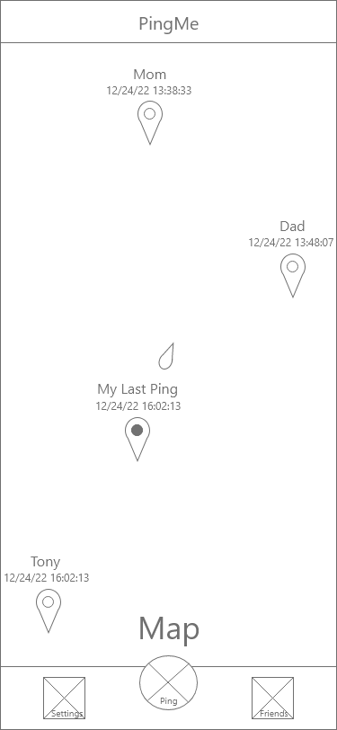
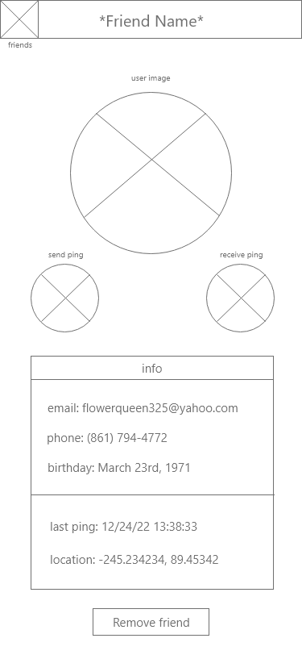

# Interaction Design

# Phase II: Interaction Design
Ping Me Usability Team
Created by Adrian Arredondo and Cole Hopkins

For our wireframe, we made the following pages with user design and experience in focus, delivering on our goals given to us from our results of the requirement gathering phase, and the personas and scenarios we constructed.

## Maps (Home)

    
    

Following User-Centered Design, we developed the main page to act as a hub for all other functionality of our application. From our scenarios, we established that our users wanted an easy and simple way in which to send their location to all their friends, so we provided a large centralized button to make it obvious to our users where this feature was. We also determined that having a main page with the two major functionalities (settings and friends) made them easy to locate and navigate, leading the user to not have to search for these functions. Furthermore, we had gained insight from our studies that users wanted an easy way to know when and where a user was last seen. Given this, we implemented markers for each friend of the user, making it easy to see who is where, and when they were last in that area.

## Friends Page

    

For our friend's page, we wanted to give simple friend info that displayed to the user when they were last pinged and where and also let users receive much more information about that friend if interacted with. One of the concerns we came across was having a relatively confusing search bar, after receiving feedback we made it clear that you were both able to add friends or filter by friends currently on your list. Most of our results from the survey indicated that adding friends via phone number was the easiest method, so users now have the option to add either by the user, or phone number.

## Friend

    
    

The individual friend page gives a lot of control to the user, allowing them to perform many actions that our survey and scenarios deemed important. One of these features is to give users the ability to not only send a ping notification to their friend but also receive a ping notification as well, which requests their friend to send their location to the user. In many of the personas scenarios we ran through, this was vital for our application, especially for emergency purposes which this applications idea was built upon. We also added the ability to remove a friend in case the user no longer wishes to be tracked by them.

## Settings

    
    

The settings page is where users can have full control over their privacy and controls for location sharing as well as being able to control all of their account information. Three of the account settings lead to their own dedicated pages to ensure that the user does not make any changes by accident. The log-out button will log out the user and return them to the log-in page. The ping frequency allows users to change how often their location is being updated, with the custom button bringing up a popup menu giving the user direct control over how often their location is updated, from seconds to days. Toggling the automatic ping feature off will allow users to only be able to update location from the maps ping button, giving more control to users who may not want to be updated automatically but manually. Since security issues were brought up by both our personas and their Scenarios, we implemented a feature that turns off location sharing altogether if the user wishes to stay incognito. There is also a toggle to turn on and off dark mode if people want a theme that is not as harsh on the eyes.

## Login/Create Account

    
    

We’ve given our users a fairly simple way to create an account or login, which adheres to industry conventions. Since our user research from the study indicated, many of them would like to use their phone number as a way to connect with others. Given these results, we decided to make phone numbers mandatory for all users so that they can either connect via that method or by username.

## Account Changes

    
    
  

The account settings page is made up of three separate account settings pages, which are change account details, change password, and delete account. The change account details page allows the user to change their email, phone number, and username with a check to see if these details are valid. The user will then need to enter their password in order to confirm these changes, providing extra security for the user's data. The account deletion page is similar in design except that the user needs to enter their password twice in order to delete their account. The password reset page allows the user to change their password. In order to do so, they need to enter a code that is sent to their email. This is in order to ensure that it is the account owner that wants to change the password and add an extra step to the process so they are extra sure that they want to make this change. The user will then input their current password (as a security measure) and then type their new password into the prompt, after confirming their new password they can submit the change.

## Supplementary Materials
* [Wireframes](../artifacts/wireframes.pdf)
* Prototype: https://xd.adobe.com/view/d49a1b5a-8898-4a6b-a2b4-039fdb4dc615-81c9/
